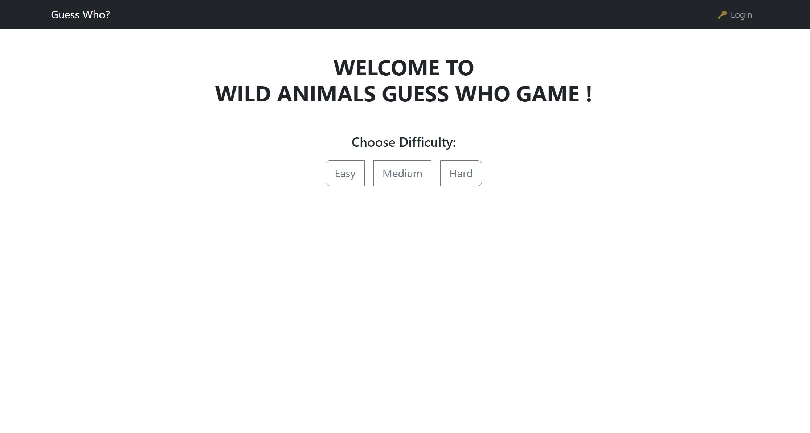
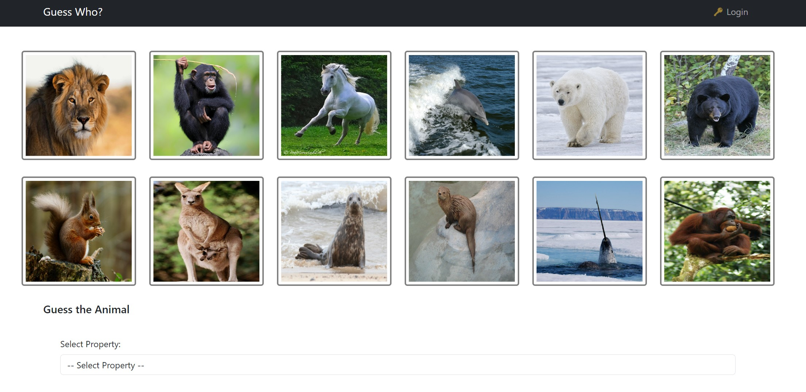

# Guess Who?

## Registered Users

Here you can find a list of the users already registered inside the provided database.

|         email         |   name   | plain-text password |
|-----------------------|----------|---------------------|
| user1@example.com     | user1    | password1           |
| user2@example.com     | user2    | password2           |
| user3@example.com     | user3    | password3           |


## React Client Application Routes

- Route `/`: The default route for the application. It displays the GameBoard component.
- Route `/history`: The route displays the user's match history using the History component. It shows completed matches and the user's total score.
- Route `/login`: route displays login page. If the user is already logged in, it redirects to the home page.

## API Server

### Game management


#### Get Easy Items

* HTTP method: `GET`  URL: `/api/easy`
* Description: Get a list of easy difficulty items for the game
* Request body: _None_
* Response: `200 OK` (success)
* Response body: Array of objects, each describing one item:

``` json
[
  {
    "id": 1,
    "image_url": "/images/lion.jpg",
    "properties": {
      "nutrition": "carnivore",
      "legs": "4",
      "color": "brown",
      "habitat": "savanna",
      "size": "large",
      "behavior": "social",
    }
  },
  {
    "id": 2,
    "image_url": "/images/chimp.jpg",
    "properties": {
      "nutrition": "omnivore",
      "legs": "2",
      "color": "black",
      "habitat": "forest",
      "size": "medium",
      "behavior": "social",
    }
  },
  ...
]
```

* Error responses:  `500 Internal Server Error` (generic error)


#### Get Medium Items

* HTTP method: `GET`  URL: `/api/medium`
* Description: Get a list of medium difficulty items for the game
* Request body: _None_
* Response: `200 OK` (success)
* Response body: Array of objects, each describing one item:

``` json
[
  {
    "id": 13,
    "image_url": "/images/turtle.jpg",
    "properties": {
      "nutrition": "herbivore",
      "legs": "4",
      "color": "green",
      "habitat": "aquatic",
      "size": "small",
      "behavior": "solitary",
    }
  },
  {
    "id": 14,
    "image_url": "/images/iguana.jpg",
    "properties": {
      "nutrition": "herbivore",
      "legs": "4",
      "color": "green",
      "habitat": "forest",
      "size": "medium",
      "behavior": "solitary",
    }
  },
  ...
]
```

* Error responses:  `500 Internal Server Error` (generic error)

#### Get Hard Items

* HTTP method: `GET`  URL: `/api/hard`
* Description: Get a list of hard difficulty items for the game
* Request body: _None_
* Response: `200 OK` (success)
* Response body: Array of objects, each describing one item:

``` json
[
  {
    "id": 25,
    "image_url": "/images/zebra.jpg",
    "properties": {
      "nutrition": "herbivore",
      "legs": "4",
      "color": "black and white",
      "habitat": "grassland",
      "size": "medium",
      "behavior": "social",
    }
  },
  {
    "id": 26,
    "image_url": "/images/warthog.jpg",
    "properties": {
      "nutrition": "omnivore",
      "legs": "4",
      "color": "gray",
      "habitat": "savanna",
      "size": "medium",
      "behavior": "social",
    }
  },
  ...
]
```

* Error responses:  `500 Internal Server Error` (generic error)

#### Start Easy Game

* HTTP method: `POST`  URL: `/api/start-easy`
* Description: Start a new easy difficulty game
* Request body: _None_
* Response: `200 OK` (success)
* Response body: Object describing the game:

``` JSON
{
    "gameId": 1
}
```

* Error responses: `503 Service Unavailable` (database error)


#### Start Medium Game

* HTTP method: `POST`  URL: `/api/start-medium`
* Description: Start a new medium difficulty game
* Request body: _None_
* Response: `200 OK` (success)
* Response body: Object describing the game:

``` JSON
{
    "gameId": 2
}
```

* Error responses: `503 Service Unavailable` (database error)


#### Start Hard Game

* HTTP method: `POST`  URL: `/api/start-hard`
* Description: Start a new hard difficulty game
* Request body: _None_
* Response: `200 OK` (success)
* Response body: Object describing the game:

``` JSON
{
    "gameId": 3
}
```

* Error responses: `503 Service Unavailable` (database error)


#### Check Guess

* HTTP method: `POST`  URL: `/api/guess`
* Description: Check a player's guess in an ongoing game
* Request body: Object describing the guess:
``` JSON
{
   "gameId": 1,
   "selectedProperty": "color",
   "selectedValue": "brown"
}
```
* Response: `200 OK` (success)
* Response body: Object describing the guess result:

``` JSON
{
  "isCorrect": true,
  "message": "Congratulations! Your guess is correct."
}
```
or

``` JSON
{
  "isCorrect": false,
  "message": "Oops! Your guess is incorrect."
}
```

* Error responses: `404 Not Found`  if the game or secret item is not found, `500 Internal Server Error`for other errors


#### Check Match

* HTTP method: `POST`  URL: `/api/guess`
* Description: Allows the user to complete a game and check if the item selected by the user matches with the secret item for the given game identifier.
* Request body: Object describing the game:
``` JSON
{
   "gameId": 1
}
```
* Response: `200 OK` (success)
* Response body: Object describing the secret item:

``` JSON
{
    "secretItemId": 1
}
```

* Error responses: `404 Not Found`  if the game or secret item is not found, `500 Internal Server Error`for other errors


#### Complete Game (for logged in user)

* HTTP method: `PUT`  URL: `/api/complete`
* Description: Allows a logged-in user to update and store game-related data in the database, including information such as the game's start date, difficulty, and score. 
* Request body: Object describing the completed game:
``` JSON
{
   "gameId": 1,
   "startDate": "2023-08-21",
   "difficulty": "medium",
   "score": 9
}
```
* Response: `200 OK` (success)
* Response body: Object containing information about the updated game and total score:

``` JSON
{
  "updatedGame": {
    "gameId": 1,
    "userId": 1,
    "startDate": "2023-08-21",
    "difficulty": "medium",
    "score": 9
  },
  "updatedTotalScore": "Total score is updated!"
}
```

* Error responses: `404 Not Found`  if the game or total score is not updated, `500 Internal Server Error`for other errors


#### Get Match History (for logged in user)

* HTTP method: `GET`  URL: `/api/history`
* Description: Get the match history for the logged-in user by retrieving data from the "games" table for the given user ID
* Request body: _None_
* Response: `200 OK` (success)
* Response body: Array of objects, each describing one match in the user's history:

``` json
[
  {
    "id": 1,
    "startDate": "20/08/2023",
    "difficulty": "medium",
    "secretItemId": 123,
    "score": 7
  },
  {
    "id": 2,
    "startDate": "18/08/2023",
    "difficulty": "easy",
    "secretItemId": 456,
    "score": 9
  },
  ...
]

```
* Error responses:  `500 Internal Server Error` (generic error)


#### Get Item by ID

* HTTP method: `GET`  URL: `/api/items/:id`
* Description: Get an item by its unique identifier (ID) from the "items" table
* Request body: _None_
* Request URL parameter: id (integer). The unique identifier of the item to retrieve.
* Response: `200 OK` (success), `404 Not Found` if the item with the specified ID is not found, `500 Internal Server Error` for other errors
* Response body: Object describing the item: (if `200 OK`)

``` json
{
  "id": 1,
  "image_url": "/images/lion.jpg",
  "properties": {
    "nutrition": "carnivore",
    "legs": "4",
    "color": "brown",
    "habitat": "savanna",
    "size": "large",
    "behavior": "social",
  }
}

```
* Error responses: (if 404 Not Found):
``` json
{
  "error": "Item not found."
}
```


#### Get User by ID

* HTTP method: `GET`  URL: `/api/users/:id`
* Description: Get a user by their unique identifier (ID) from the "users" table
* Request body: _None_
* Request URL parameter: id (integer). The unique identifier of the user to retrieve.
* Response: `200 OK` (success), `404 Not Found` if the user with the specified ID is not found, `500 Internal Server Error` for other errors
* Response body: Object describing the user: (if `200 OK`)

``` json
{
  "id": 1,
  "username": "user1@example.com",
  "name": "user1",
  "total_score": 402
}

```
* Error responses: (if 404 Not Found):
``` json
{
  "error": "User not found."
}
```

#### Delete Incomplete Games

* HTTP method: `DELETE`  URL: `/api/incomplete`
* Description: Delete incomplete games from the database for the logged-in user and clear the match history of anonymous users
* Request body: _None_
* Request URL parameter: id (integer). The unique identifier of the user to retrieve.
* Response: `200 OK` (success) if the deletion is successful, even if there are no incomplete games, `404 Not Found`  if there was an issue with the deletion operation, `500 Internal Server Error` for database-related errors
* Response body: An empty JSON object {} indicating a successful deletion. (if `200 OK`)

* Error responses: (if 404 Not Found): Object indicating that the deletion operation encountered an issue:
``` json
{
  "error": "Deletion failed."
}

```

### User management

#### Login

* HTTP method: `POST`  URL: `/api/sessions`
* Description: authenticate the user who is trying to login
* Request body: credentials of the user who is trying to login

``` JSON
{
    "username": "user1@example.com",
    "password": "password1"
}
```

* Response: `200 OK` (success)
* Response body: authenticated user

``` JSON
{
    "id": 1,
    "username": "user1@example.com", 
    "name": "user1"
}
```

* Error responses:  `500 Internal Server Error` (generic error), `401 Unauthorized User` (login failed)

#### Check if user is logged in

* HTTP method: `GET`  URL: `/api/sessions/current`
* Description: check if current user is logged in and get her data
* Request body: _None_
* Response: `200 OK` (success)

* Response body: authenticated user

``` JSON
{
    "id": 1,
    "username": "user1@example.com", 
    "name": "user1"
}
```

* Error responses: `500 Internal Server Error` (generic error), `401 Unauthorized User` (user is not logged in)

#### Logout

* HTTP method: `DELETE`  URL: `/api/sessions/current`
* Description: logout current user
* Request body: _None_
* Response: `200 OK` (success)

* Response body: _None_

* Error responses: `500 Internal Server Error` (generic error), `401 Unauthorized User` (user is not logged in)

## Database Tables

- Table `users` -  contains id username name salt hash total_score
- Table `items` - contains id image_url properties
- Table `games` - contains id user_id start_date difficulty score secret_id 

## Main React Components

- `App Component` (in `App.jsx`)
* Purpose: This is the root component of the React application.
* Main Functionality: It sets up the routing for the application using React Router (BrowserRouter) and defines the routes.
* Child components: 
  - Navigation: Renders the navigation bar
  - Container: Provides a container for the page content
  - Outlet: Acts as a placeholder for the content of child routes
- `Navigation Component` (in `Navigation.jsx`)
* Purpose:  Provides navigation links, typically displayed in a header.
* Main Functionality: Shows navigation links based on whether the user is logged in or not. It also provides a logout button.
* Child Components: None.
- `GameBoard Component` (in `GameBoard.jsx`)
* Purpose: Renders the main game board where the user interacts with the game.
* Main Functionality: Handles game-related functionalities, including selecting a difficulty, starting the game, making guesses, and displaying game results.
* Child Components: 
  - DifficultySelector: Displays difficulty options and allows the user to choose a difficulty level 
  - Item: Represents an item (wild animal) that the user can select 
  - Guess: Allows the user to submit a guess for the secret item
- `History Component` (in `History.jsx`)
* Purpose: Displays the user's match history.
* Main Functionality: Lists completed game matches, showing details such as match date, difficulty, secret item, score, and total score.
- `LoginForm Component` (in `Auth.jsx`)
* Purpose: Provides a login form for users to log in.
* Main Functionality: Handles user authentication by submitting the login form.


## Screenshot





